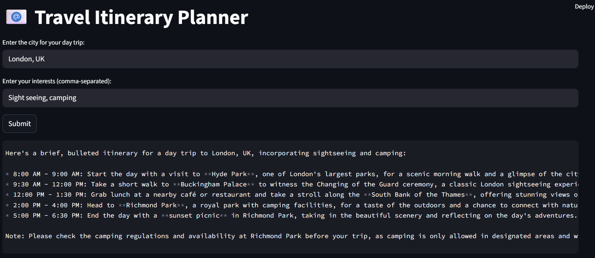

# Agentic AI for Travel Planner
## Introduction
This is a Multi-AI Agent demo project to generate Travel Itinerary Planner using the LangGraph to automate the process of planning a trip. 

## LangGraph Framework
LangGraph is a Python framework for designing and managing the flow of tasks in your application using graph structures.

## Running the Script

- **Configure Environment**: Install uv to Set up virtual environment. To get started we first need to get an API_KEY from here: https://console.groq.com/keys. Inside `.env` update the value of `GROQ_API_KEY` with the API_KEY you created. 
- **Install Dependencies**: Run `uv pip install -r pyproject.toml`.
- **Execute the Script**: Run `uv run --env-file=.env streamlit run .\main.py` and input your idea.

## Details & Explanation
- **Running the Script**: Execute `uv run --env-file=.env streamlit run .\main.py` and input your idea when prompted. The script will leverage the LangGraph framework to process the idea and generate a landing page.
- **Key Components**:
  - `./main.py`: Main script file with state graph.
  - `./nodes.py`: Main file with the state and node functions.

